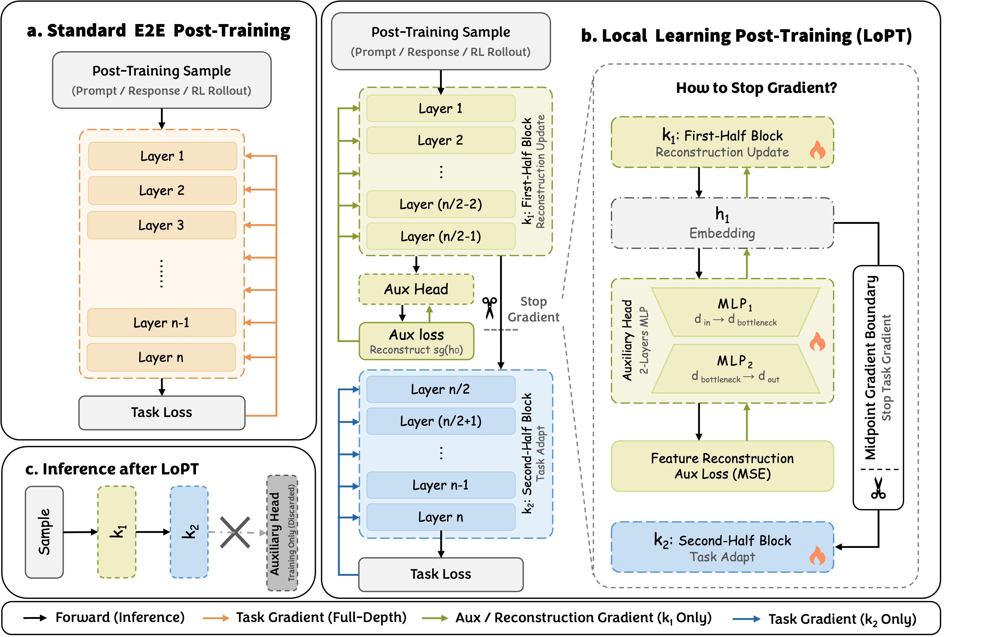

<div align="center">

  <h1>
    
    LoPT：局部学习后训练
  </h1>

  <p>
    <strong>一种更省、更快的 LLM 后训练方案，通过控制任务梯度的传播范围实现。</strong>
  </p>

  <p>
    LoPT 在 decoder-only LLM 中插入一个中间 stop-gradient 边界：
    后半段 block 从任务目标学习，前半段 block 通过轻量级 feature reconstruction 更新。
  </p>

  <p>
    <a href="https://arxiv.org/abs/2605.04913">
      
    </a>
    <a href="README.md">
      
    </a>
    <a href="README_zh.md">
      
    </a>
  </p>

  <p>
    <a href="#-安装">安装</a> ·
    <a href="#-快速开始">快速开始</a> ·
    <a href="#-方法概述">方法</a> ·
    <a href="#-训练">训练</a> ·
    <a href="#-评估">评估</a>
  </p>

</div>

---

## 🧭 概述

**LoPT** 是一个面向 decoder-only 语言模型的轻量级后训练方案。  
与标准端到端训练不同，LoPT 通过将模型拆分为两个或多个连续 block，显式控制**梯度传播范围**。

在默认的两段式设置中：

- **后半段 block** 接收标准任务 loss；
- **前半段 block** 被保护，不受任务梯度的直接传播影响；
- 前半段通过**局部 feature reconstruction 目标**保持可训练；
- block 边界处的 hidden state 被 detach，减少全深度反向传播耦合。

训练结束后，辅助 reconstruction head 被丢弃。保存的模型仍然是标准的 Hugging Face causal LM，可直接用 `AutoModelForCausalLM` 加载。

---

## ✨ 特性

| 能力 | 描述 |
|---|---|
| **SFT 支持** | 端到端和 LoPT 监督微调 |
| **GRPO 支持** | 基于 Hugging Face TRL 的在线 GRPO 训练 |
| **默认 LoPT 分割** | 两段式 LoPT：`--num_blocks 2` |
| **多段 LoPT** | 四段式 LoPT：`--num_blocks 4` |
| **HF 兼容 checkpoint** | 保存为标准 Hugging Face causal LM 模型 |
| **推理时无额外计算** | 辅助 head 仅在训练时使用 |

---

## 🗺️ 路线图

- [x] 开源训练代码
- [x] 论文发布至 arXiv
- [ ] 发布 checkpoint 模型

---

## 🧠 方法概述

标准端到端后训练会让任务 loss 反向传播通过所有 transformer 层。  
LoPT 在保持任务目标不变的前提下，改变反向传播路径。

模型被拆分为连续的 block：

<p align="center">
  
</p>

核心思想很简单：

> **任务梯度只适配面向任务的深层，浅层通过局部目标更新以保留有用表征并维持兼容接口。**

因此 LoPT 与 LoRA、gradient checkpointing、DeepSpeed/ZeRO、pipeline parallelism 等常用效率工具互补。

---

## ⚙️ 安装

```bash
git clone https://github.com/HumyuShi/LoPT.git
cd LoPT

conda create -n lopt python=3.11 -y
conda activate lopt

pip install -r requirements.txt
```

如果当前 CUDA driver 不支持 `pip` 默认解析的 PyTorch wheel，可以先安装匹配的 PyTorch wheel，再安装其余依赖。

例如：

```bash
pip install --index-url https://download.pytorch.org/whl/cu118 torch==2.6.0+cu118
pip install -r requirements.txt
```

多卡 GRPO 训练前建议先配置 Accelerate：

```bash
accelerate config
```

---

## 🚀 快速开始

### LoPT SFT

```bash
torchrun --nproc_per_node 8 train_sft.py \
  --model_name_or_path Qwen/Qwen2.5-7B-Instruct \
  --dataset_preset metamathqa \
  --method ll \
  --num_blocks 2 \
  --max_seq_length 1024 \
  --per_device_train_batch_size 4 \
  --learning_rate 2e-5 \
  --lr_k1 2e-5 \
  --lambda_aux 10 \
  --gradient_checkpointing \
  --output_dir outputs/qwen25-7b-metamathqa-lopt-k2
```

### LoPT GRPO

```bash
accelerate launch --num_processes 8 train_grpo.py \
  --model_name_or_path Qwen/Qwen2.5-7B-Instruct \
  --task gsm8k \
  --method ll \
  --num_blocks 2 \
  --per_device_train_batch_size 1 \
  --gradient_accumulation_steps 8 \
  --num_generations 4 \
  --steps_per_generation 1 \
  --num_iterations 1 \
  --loss_type grpo \
  --learning_rate 1e-6 \
  --lr_k1 1e-6 \
  --lambda_aux 10 \
  --gradient_checkpointing \
  --output_dir outputs/qwen25-7b-gsm8k-grpo-lopt-k2
```

---

## 🤖 支持的模型

你可以传入任何 Llama/Qwen/Mistral 风格的 decoder-only 模型（在 `AutoModelForCausalLM` 中暴露为 `model.layers`）的本地路径或 Hugging Face model ID。

内置别名：

| 别名 | Hugging Face model |
|---|---|
| `qwen3-4b` | `Qwen/Qwen3-4B` |
| `qwen2.5-7b` | `Qwen/Qwen2.5-7B-Instruct` |
| `qwen2.5-32b` | `Qwen/Qwen2.5-32B-Instruct` |
| `llama3.1-8b` | `meta-llama/Llama-3.1-8B-Instruct` |

---

## 📚 训练数据集

| Preset | 用途 | 官方地址 |
|---|---:|---|
| `metamathqa` | SFT | https://huggingface.co/datasets/meta-math/MetaMathQA |
| `alpaca` | SFT | https://huggingface.co/datasets/tatsu-lab/alpaca |
| `tulu3` | SFT | https://huggingface.co/datasets/allenai/tulu-3-sft-mixture |
| `gsm8k` | GRPO | https://huggingface.co/datasets/openai/gsm8k |
| `numinamath` | GRPO | https://huggingface.co/datasets/AI-MO/NuminaMath-CoT |

> [!NOTE]
> 训练前请检查原始模型和数据集 license。部分来源（包括 Llama 系列模型和 Alpaca）存在访问或使用限制。

训练脚本可以直接从 Hugging Face 加载数据，也可以提前下载并导出为本地 Parquet：

```bash
python scripts/download_datasets.py --dataset all
python scripts/download_datasets.py --dataset metamathqa --write_parquet --output_dir data
```

本地 Parquet 或 JSON 文件可以通过以下方式传入：

```bash
--train_file path/to/data.parquet
```

---

## 📊 Benchmark 数据集

论文中的 benchmark 使用以下官方数据集版本。

| Benchmark | 评测方向 | Config / split | 官方地址 |
|---|---|---|---|
| MMLU | 多任务知识 | 官方 subject splits | https://huggingface.co/datasets/cais/mmlu |
| IFEval | 指令遵循 | default release | https://huggingface.co/datasets/google/IFEval |
| ARC-Challenge | 科学推理 | `ARC-Challenge` | https://huggingface.co/datasets/allenai/ai2_arc |
| GSM8K | 小学数学推理 | `main`, `test` | https://huggingface.co/datasets/openai/gsm8k |
| HellaSwag | 常识补全 | default release | https://huggingface.co/datasets/allenai/hellaswag |
| TruthfulQA | 真实性 | multiple-choice / generation configs | https://huggingface.co/datasets/truthfulqa/truthful_qa |
| WinoGrande | 常识指代消解 | validation / test release | https://huggingface.co/datasets/allenai/winogrande |

---

## 🏋️ 训练

### SFT: LoPT, `k=2`

```bash
torchrun --nproc_per_node 8 train_sft.py \
  --model_name_or_path Qwen/Qwen2.5-7B-Instruct \
  --dataset_preset metamathqa \
  --method ll \
  --num_blocks 2 \
  --max_seq_length 1024 \
  --per_device_train_batch_size 4 \
  --learning_rate 2e-5 \
  --lr_k1 2e-5 \
  --lambda_aux 10 \
  --gradient_checkpointing \
  --output_dir outputs/qwen25-7b-metamathqa-lopt-k2
```

### SFT: LoPT, `k=4`

```bash
torchrun --nproc_per_node 8 train_sft.py \
  --model_name_or_path Qwen/Qwen2.5-7B-Instruct \
  --dataset_preset metamathqa \
  --method ll \
  --num_blocks 4 \
  --max_seq_length 1024 \
  --per_device_train_batch_size 4 \
  --learning_rate 2e-5 \
  --lr_k1 2e-5 \
  --lambda_aux 10 \
  --gradient_checkpointing \
  --output_dir outputs/qwen25-7b-metamathqa-lopt-k4
```

### SFT: E2E baseline

```bash
torchrun --nproc_per_node 8 train_sft.py \
  --model_name_or_path Qwen/Qwen2.5-7B-Instruct \
  --dataset_preset metamathqa \
  --method e2e \
  --max_seq_length 1024 \
  --per_device_train_batch_size 4 \
  --learning_rate 2e-5 \
  --gradient_checkpointing \
  --output_dir outputs/qwen25-7b-metamathqa-e2e
```

### SFT: Alpaca

```bash
torchrun --nproc_per_node 8 train_sft.py \
  --model_name_or_path Qwen/Qwen2.5-7B-Instruct \
  --dataset_preset alpaca \
  --method ll \
  --num_blocks 2 \
  --max_seq_length 512 \
  --per_device_train_batch_size 4 \
  --learning_rate 2e-5 \
  --lambda_aux 10 \
  --gradient_checkpointing \
  --output_dir outputs/qwen25-7b-alpaca-lopt-k2
```

### SFT: Tulu-3

```bash
torchrun --nproc_per_node 8 train_sft.py \
  --model_name_or_path meta-llama/Llama-3.1-8B-Instruct \
  --dataset_preset tulu3 \
  --method ll \
  --num_blocks 2 \
  --max_seq_length 2048 \
  --per_device_train_batch_size 2 \
  --learning_rate 2e-5 \
  --lambda_aux 10 \
  --gradient_checkpointing \
  --output_dir outputs/llama31-8b-tulu3-lopt-k2
```

---

## 🎯 GRPO 训练

GRPO 使用 TRL `GRPOTrainer`，训练过程中 completion 来自当前 actor 的在线采样。

### GRPO: GSM8K, LoPT `k=2`

```bash
accelerate launch --num_processes 8 train_grpo.py \
  --model_name_or_path Qwen/Qwen2.5-7B-Instruct \
  --task gsm8k \
  --method ll \
  --num_blocks 2 \
  --per_device_train_batch_size 1 \
  --gradient_accumulation_steps 8 \
  --num_generations 4 \
  --steps_per_generation 1 \
  --num_iterations 1 \
  --loss_type grpo \
  --learning_rate 1e-6 \
  --lr_k1 1e-6 \
  --lambda_aux 10 \
  --gradient_checkpointing \
  --output_dir outputs/qwen25-7b-gsm8k-grpo-lopt-k2
```

### GRPO: GSM8K, LoPT `k=4`

```bash
accelerate launch --num_processes 8 train_grpo.py \
  --model_name_or_path Qwen/Qwen2.5-7B-Instruct \
  --task gsm8k \
  --method ll \
  --num_blocks 4 \
  --per_device_train_batch_size 1 \
  --gradient_accumulation_steps 8 \
  --num_generations 4 \
  --steps_per_generation 1 \
  --num_iterations 1 \
  --loss_type grpo \
  --learning_rate 1e-6 \
  --lr_k1 1e-6 \
  --lambda_aux 10 \
  --gradient_checkpointing \
  --output_dir outputs/qwen25-7b-gsm8k-grpo-lopt-k4
```

### GRPO: GSM8K, E2E baseline

```bash
accelerate launch --num_processes 8 train_grpo.py \
  --model_name_or_path Qwen/Qwen2.5-7B-Instruct \
  --task gsm8k \
  --method e2e \
  --per_device_train_batch_size 1 \
  --gradient_accumulation_steps 8 \
  --num_generations 4 \
  --steps_per_generation 1 \
  --num_iterations 1 \
  --loss_type grpo \
  --learning_rate 1e-6 \
  --gradient_checkpointing \
  --output_dir outputs/qwen25-7b-gsm8k-grpo-e2e
```

### GRPO: NuminaMath

```bash
accelerate launch --num_processes 8 train_grpo.py \
  --model_name_or_path Qwen/Qwen2.5-7B-Instruct \
  --task numinamath \
  --method ll \
  --num_blocks 2 \
  --per_device_train_batch_size 1 \
  --gradient_accumulation_steps 8 \
  --num_generations 4 \
  --max_completion_length 512 \
  --steps_per_generation 1 \
  --num_iterations 1 \
  --loss_type grpo \
  --learning_rate 1e-6 \
  --lambda_aux 10 \
  --gradient_checkpointing \
  --output_dir outputs/qwen25-7b-numinamath-grpo-lopt-k2
```

---

## 🧪 Smoke Test

正式训练前，可以先用小模型和少量样本跑通。

### SFT smoke test

```bash
CUDA_VISIBLE_DEVICES=0 python train_sft.py \
  --model_name_or_path HuggingFaceTB/SmolLM2-135M-Instruct \
  --dataset_preset alpaca \
  --method ll \
  --num_blocks 2 \
  --max_seq_length 64 \
  --max_samples 16 \
  --max_steps 2 \
  --per_device_train_batch_size 1 \
  --output_dir outputs/smoke-sft-lopt
```

### GRPO smoke test

```bash
CUDA_VISIBLE_DEVICES=0 python train_grpo.py \
  --model_name_or_path HuggingFaceTB/SmolLM2-135M-Instruct \
  --task gsm8k \
  --method ll \
  --num_blocks 2 \
  --max_samples 8 \
  --max_steps 1 \
  --num_generations 2 \
  --gradient_accumulation_steps 2 \
  --max_prompt_length 128 \
  --max_completion_length 64 \
  --steps_per_generation 2 \
  --num_iterations 1 \
  --loss_type grpo \
  --per_device_train_batch_size 1 \
  --output_dir outputs/smoke-grpo-lopt
```

---

## 📄 论文

如果本仓库对你的研究有帮助，欢迎阅读或引用我们的论文：

- arXiv: https://arxiv.org/abs/2605.04913

```bibtex
@misc{shi2026lopt,
  title        = {Rethinking Local Learning: A Cheaper and Faster Recipe for LLM Post-Training},
  author       = {Shi, Hengyu and Han, Tianyang and Wang, Peizhe and Wang, Zhiling and Yang, Xu and Su, Junhao},
  year         = {2026},
  eprint       = {2605.04913},
  archivePrefix = {arXiv},
  primaryClass = {cs.CL}
}
```

---

## 📌 说明

- 辅助 reconstruction head 仅在训练时使用，推理时自动移除。
- LoPT checkpoint 可作为标准 Hugging Face causal LM 模型加载。
- `--method ll` 启用 LoPT 局部学习模式。
- `--method e2e` 启用端到端 baseline。
- `--num_blocks 2` 为默认的中点分割。
- `--num_blocks 4` 启用更细粒度的局部学习变体。

---

## 📜 许可证

训练或再分发前请检查所有上游模型和数据集的 license。本仓库遵循项目中指定的许可协议。
